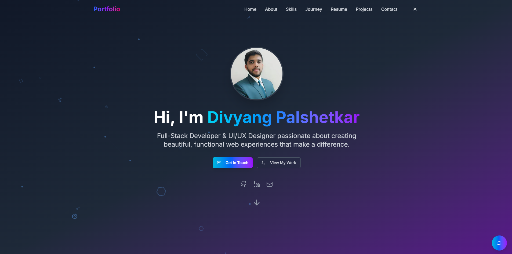

# Modern Portfolio Website 🔗 [Link](https://pulsemeet.vercel.app)  



## 🚀 Overview

A modern, interactive portfolio website built with Next.js, featuring a 3D hero section, interactive animations, dark/light mode, and an AI-powered chatbot assistant. This portfolio showcases projects, skills, and professional experience in an engaging and responsive design.

## ✨ Features

- **Interactive 3D Hero Section** - Dynamic tech-themed animations and particles
- **Dark/Light Theme** - Seamless theme switching with local storage persistence
- **Responsive Design** - Optimized for all devices from mobile to desktop
- **Smooth Animations** - Page transitions and scroll animations using Framer Motion
- **AI Chatbot Assistant** - Gemini AI-powered chatbot that answers questions about projects and skills
- **Project Showcase** - Detailed project cards with modal views for in-depth information
- **Interactive Timeline** - Visual representation of education and career journey
- **Resume Section** - Comprehensive display of skills, education, and experience
- **Contact Form** - Functional contact form with validation and feedback

## 🛠️ Technologies Used

- **Frontend**: Next.js, React, TypeScript, Tailwind CSS
- **UI Components**: shadcn/ui
- **Animations**: Framer Motion
- **3D Graphics**: Custom Canvas Animations
- **AI Integration**: Google Gemini API
- **Deployment**: Vercel

## 📋 Project Structure

```
portfolio/
├── action/
│   ├── contact-email.js/ # Resend email
├── app/                  # Next.js app directory
│   ├── api/              # API routes for chatbot and contact form
│   ├── components/       # React components
│   ├── globals.css       # Global styles
│   ├── layout.jsx        # Root layout component
│   └── page.jsx          # Main page component
├── public/               # Static assets
│   └── images/           # Image assets
└── package.json          # Project dependencies
```
